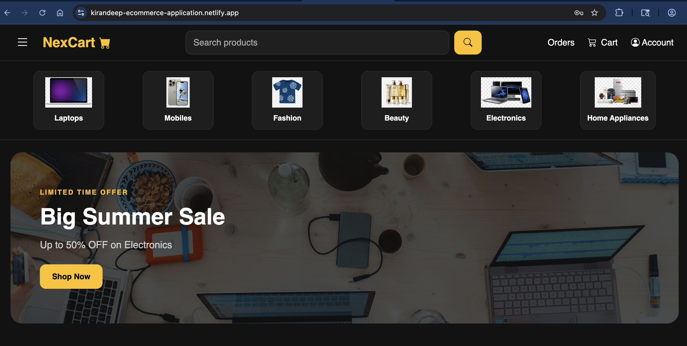
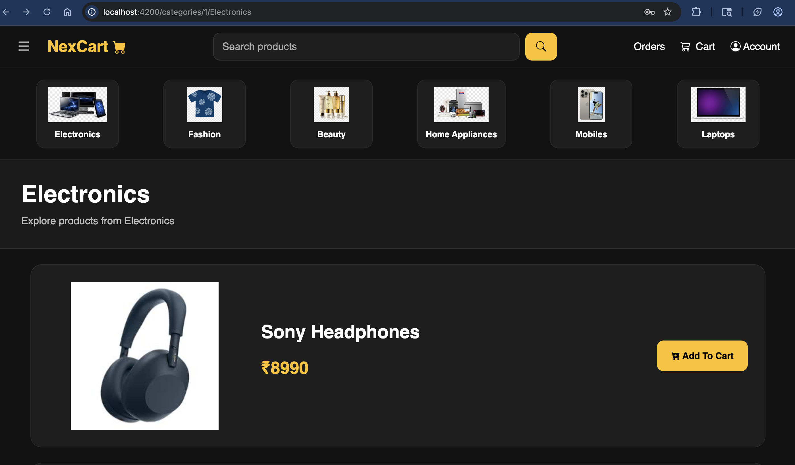
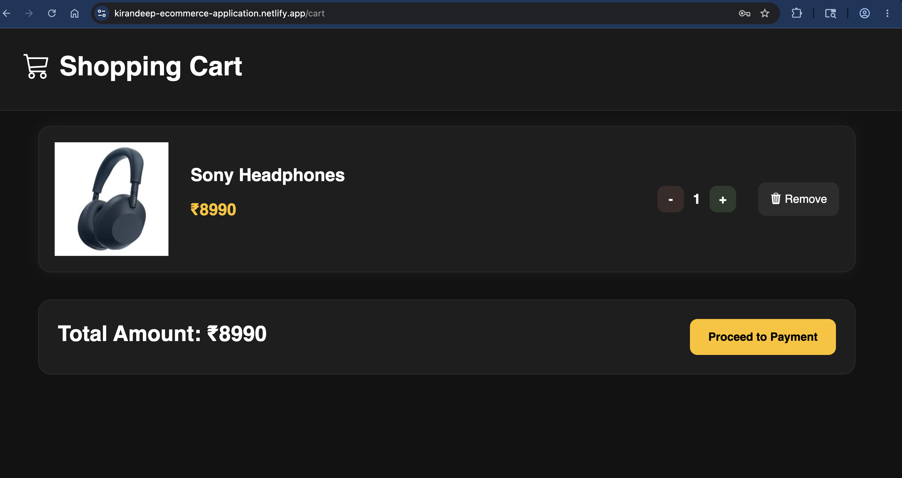
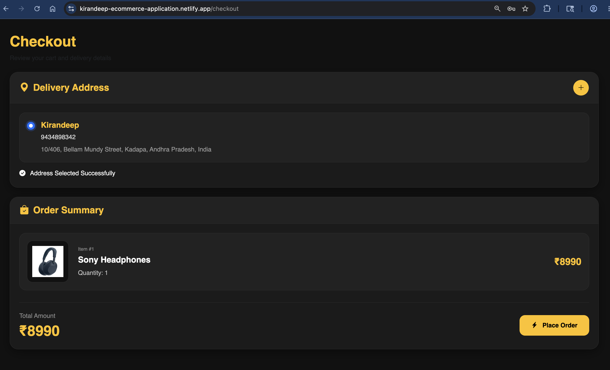
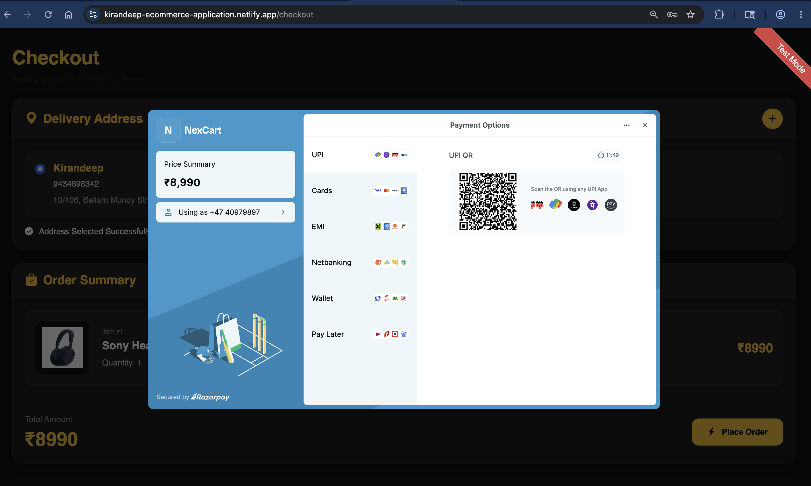
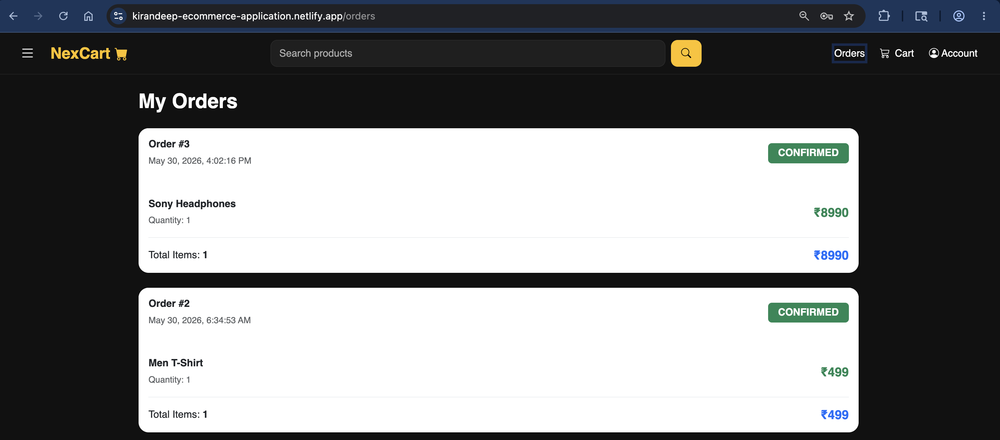
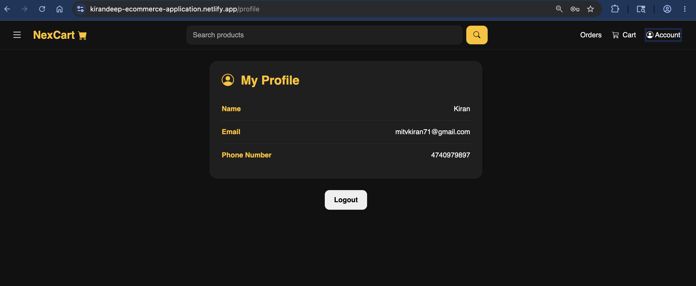

# 🛒 Ecommerce Application


---

## 📖 Overview

A full-stack Ecommerce Application built using Angular and Spring Boot. The application provides secure JWT-based authentication, product browsing, shopping cart management, address management, order processing, and Razorpay payment integration.

---

## 🚀 Live Demo

### Frontend

https://kirandeep-ecommerce-application.netlify.app

### Backend

https://ecommerce-application-vjk3.onrender.com

---

## ✨ Features

### 👤 User Features

* User Registration
* User Login
* JWT Authentication
* Product Browsing
* Featured Products
* Category Navigation
* Shopping Cart Management
* Address Management
* Razorpay Payment Integration
* Order Placement
* Order History
* Profile Management

### 🔐 Security Features

* Spring Security
* JWT Authentication
* Route Guards
* Role-Based Authorization
* Password Encryption

---

## 🛠 Tech Stack

### Frontend

* Angular
* TypeScript
* Bootstrap
* RxJS

### Backend

* Spring Boot
* Spring Security
* Spring Data JPA
* Hibernate
* JWT

### Database

* MySQL

### Deployment

* Netlify
* Render
* Railway MySQL

---

## 📷 Screenshots

### Home Page



### Featured Products


### Products Page



### Shopping Cart



### Checkout Page



### Address Management


### Razorpay Payment



### Orders Page



### Profile Page



---

## 📁 Project Structure

```text
Ecommerce_Application
│
├── Ecommerce_Backend
│   ├── Authentication
│   ├── Product Management
│   ├── Cart Management
│   ├── Address Management
│   ├── Order Management
│   ├── Payment Integration
│   └── Security Configuration
│
├── Ecommerce_Frontend
│   ├── Authentication
│   ├── Products
│   ├── Cart
│   ├── Checkout
│   ├── Orders
│   ├── Profile
│   └── Shared Components
│
└── README.md
```

---

## 🔄 Application Flow

```text
Angular Frontend
       │
       ▼
Spring Boot REST APIs
       │
       ▼
Spring Security + JWT
       │
       ▼
MySQL Database
       │
       ▼
Razorpay Payment Gateway
```

---

## ⚙️ Installation

### Backend Setup

```bash
git clone <repository-url>

cd Ecommerce_Backend

mvn clean install

mvn spring-boot:run
```

### Frontend Setup

```bash
cd Ecommerce_Frontend/ecommerce-ui

npm install

ng serve
```

---

## 🔑 Environment Variables

```properties
DB_URL=
DB_USERNAME=
DB_PASSWORD=

JWT_SECRET=

RAZORPAY_KEY=
RAZORPAY_SECRET=
```

---

## 🎯 Future Enhancements

* Wishlist
* Product Reviews
* Product Search & Filtering
* Email Notifications
* Forgot Password
* Admin Dashboard
* Order Tracking

---

## 👨‍💻 Author

### Kirandeep Gantasala

Full Stack Developer

Angular • Spring Boot • MySQL • JWT • REST APIs
